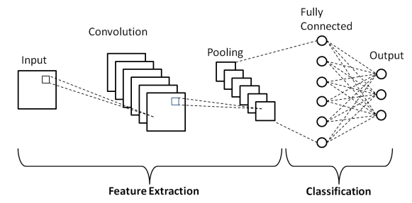

### CONVOLUTIONAL NEURAL NETWORK(CNN):

**It is a class of deep neural networks that extracts features from images, given as input, to perform specific tasks such as image classification, face recognition and semantic image system. A CNN has one or more convolution layers for simple feature extraction, which execute convolution operation (i.e. multiplication of a set of weights with input) while retaining the critical features (spatial and temporal information) without human supervision.**

### Why do we need CNN over ANN?

**CNN is needed as it is an important and more accurate way for image classification problems. With Artificial Neural Networks, a 2D image would first be converted into a 1-dimensional vector before training the model.**

**Also, with an increase in the size of the image, the number of training parameters would increase exponentially, resulting in loss of storage. Moreover, ANN cannot capture the sequential information required for sequence data.**

**Thus, CNN would always be a preferred way for dealing with 2D image classification problems because of its ability to deal with images as data, thereby providing higher accuracy.**

### CNN Architecture

